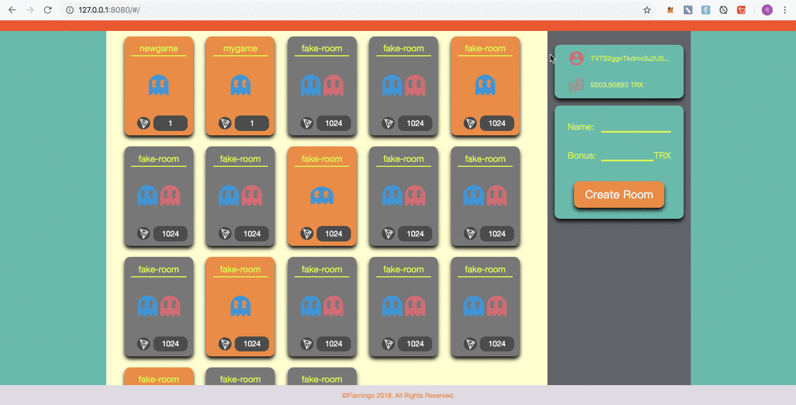
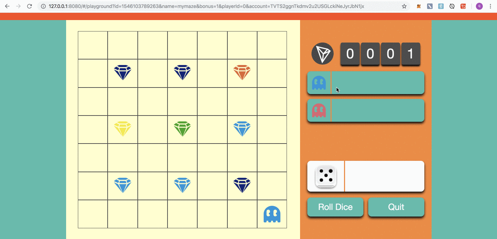
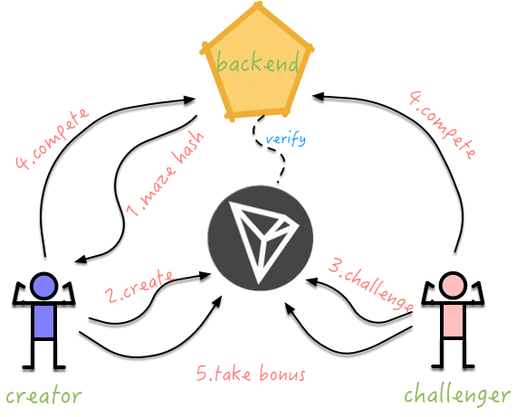

## Magic Maze

Magic Maze is a dApp game running on <font color=#FF7373>**Tron**</font> network, in order to play it you need to install <font color=#FF7373>**TronLink**</font> plugin on Chrome.

Different with ordinary maze games, the walls or barriers are <font color=#FF7373>**invisible**</font> to players. Both players need to lock some TRX in order to start the game, and take turns to roll dice and move forwad. If you unluckily hit the wall, you will be bonced back to the origin. The first player who collect 5 gems win the game and take all locked TRX as bonus, paying 1 TRX as service fee.

#### 1.Demo Videos

Home page demo: 

(For high quality video please click [here](https://v.youku.com/v_show/id_XMzk4ODM0Njg2NA==.html?spm=a2h0k.11417342.soresults.dtitle))



Single player demo:

(For high quality video please click [here](https://v.youku.com/v_show/id_XMzk4ODM0ODQ5Mg==.html?spm=a2h0k.11417342.soresults.dtitle))



#### 2.Game Workflow



#### 3.Deploy Smart Contract

You can use <font color=#FF7373>**TronBox**</font> to compile & deploy smart contract on Tron network.

Don't forget to change private key & network in contracts/tronbox.js to your own before below steps (by default the contract will be deployed to Shasta test net):

```
cd contracts
tronbox compile
tronbox migrate
```

#### 4.Run Backend Server

The backend is written in Go, so you may need to install Golang if it's not available.

```
cd back-end
./build.sh
./magic-maze
```

#### 5.Run Frontend dApp

The frontend is written in vue.js + vux + TronWeb, so node.js and npm are required.

```
cd front-end
npm install
npm run dev
```

Then you can try the game on http://127.0.0.1:8080, enjoy!

#### 6.Future Plan

- Refine PVP mode logic
- Use mysql as persistence layer
- Improve UI experience